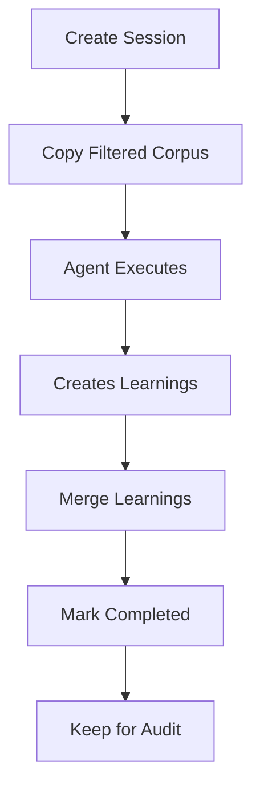

# Agent Session Isolation

**Status**: Infrastructure ready, integration pending
**Based on**: [OpenClaw AGENTS.md](https://github.com/openclaw/openclaw/blob/main/AGENTS.md)

---

## Overview

Agent Session Isolation prevents context corruption when multiple agents run in parallel by giving each agent its own isolated working directory.

### The Problem

**Current State** (without isolation):
```
All 38 agents share:
- .agentic_sdlc/corpus/ (knowledge base)
- .project/ (project artifacts)
- Working directory (git repo)

Risk: Agent A can corrupt Agent B's work
Example: parallel-workers running 3 concurrent code-author instances
```

**Example Failure Scenario**:
```bash
# Worker 1: Implementing feature A
Agent writes: .agentic_sdlc/corpus/nodes/decisions/ADR-123.yml

# Worker 2: Implementing feature B (same time)
Agent reads: .agentic_sdlc/corpus/nodes/decisions/*.yml
# Sees incomplete ADR-123 from Worker 1 → corruption

# Result: Worker 2 makes decisions based on incomplete data
```

### The Solution

**With isolation**:
```
Agent A:
  ~/.claude/agents/code-author-task-001/
    corpus/         # Filtered copy (only Phase 5 nodes)
    learnings/      # Agent-specific learnings
    workspace/      # Isolated work area

Agent B:
  ~/.claude/agents/code-author-task-002/
    corpus/         # Same filtered copy (independent)
    learnings/      # Independent learnings
    workspace/      # Independent work area

After completion:
  - Merge learnings → .agentic_sdlc/corpus/nodes/learnings/
  - No corpus pollution
  - No cross-agent interference
```

---

## Architecture

### Directory Structure

```
~/.claude/agents/
├── <agent-id>/                 # Unique per agent instance
│   ├── session.yml             # Session metadata
│   ├── corpus/                 # Filtered corpus copy
│   │   ├── decisions/          # Relevant ADRs only
│   │   ├── learnings/          # Relevant learnings
│   │   └── patterns/           # Relevant patterns
│   ├── learnings/              # New learnings from this session
│   │   └── LEARN-xxx.yml       # Created during execution
│   └── workspace/              # Working directory
│       └── (agent-specific files)
└── <another-agent-id>/
    └── ...
```

### Session Lifecycle



**Phases**:
1. **Create**: `AgentSession(agent_id).create()` → isolated directory
2. **Execute**: Agent works in isolation (no shared state)
3. **Merge**: `session.merge_learnings()` → copy back to main corpus
4. **Cleanup**: Mark as completed (don't delete - audit trail)

---

## Usage

### Basic Usage

```python
from agent_isolation import AgentSession

# Create isolated session
session = AgentSession("code-author-task-123")
session.create()

# Agent works here
corpus_dir = session.get_corpus_dir()  # ~/.claude/agents/.../corpus
workspace = session.get_workspace_dir()  # ~/.claude/agents/.../workspace

# After completion
session.merge_learnings()  # Merge back to main corpus
session.cleanup()  # Mark as completed
```

### CLI Usage

```bash
# Create session
python3 .claude/lib/python/agent_isolation.py create code-author-task-123

# Output:
# ✅ Created session: ~/.claude/agents/code-author-task-123
#    Corpus: ~/.claude/agents/code-author-task-123/corpus
#    Workspace: ~/.claude/agents/code-author-task-123/workspace

# List active sessions
python3 .claude/lib/python/agent_isolation.py list

# Output:
# 📊 Active sessions (2):
#    - code-author-task-123
#    - qa-analyst-task-456

# Cleanup session
python3 .claude/lib/python/agent_isolation.py cleanup code-author-task-123

# Output:
# ✅ Cleaned up session: code-author-task-123
#    Merged learnings: 3 files
```

---

## Integration with Parallel Workers

### Current State (v3.0.0)

**parallel-workers** (Phase 5) uses git worktrees for isolation:
- ✅ Isolated git working directories
- ❌ Shared corpus (all workers see same nodes)
- ❌ No session isolation

### Future Integration (v3.1.0+)

**Enhanced parallel-workers** with session isolation:

```python
# .claude/skills/parallel-workers/scripts/worker_manager.py

def spawn_worker(task_id: str, agent: str):
    # Create isolated session
    session = AgentSession(f"{agent}-{task_id}")
    session.create(corpus_filter=f"phase:5")  # Only Phase 5 nodes

    # Spawn worker with isolated session
    worker = Worker(
        task_id=task_id,
        agent=agent,
        session_dir=session.session_dir,
        corpus_dir=session.get_corpus_dir(),  # Isolated corpus
        workspace=session.get_workspace_dir()
    )

    # After completion
    worker.wait()
    session.merge_learnings()  # Merge back
    session.cleanup()
```

**Benefits**:
1. **No corpus pollution**: Each worker has independent corpus copy
2. **No read corruption**: Workers don't see each other's incomplete ADRs
3. **Clean merge**: Learnings merged back without conflicts
4. **Audit trail**: Session directories kept for debugging

---

## Corpus Filtering

### Filter Patterns

Corpus can be filtered when creating sessions:

```python
# Copy only Phase 3 related nodes
session.create(corpus_filter="phase:3")

# Copy only architecture decisions
session.create(corpus_filter="type:decision")

# Copy only recent nodes (last 5)
session.create(corpus_filter="recent:5")  # Default
```

### Current Implementation

**v3.0.0**: Only recent filtering (last 5 decisions)

```python
def _copy_filtered_corpus(self, corpus_filter: Optional[str] = None):
    if not corpus_filter:
        # Copy last 5 decisions only
        decision_files = sorted(..., key=lambda p: p.stat().st_mtime, reverse=True)[:5]
```

**Future** (v3.1.0+): Advanced filtering by phase, type, tags

---

## Safety Guarantees

### What is Isolated

✅ **Isolated per session**:
- Corpus nodes (filtered copy)
- Learnings (session-specific)
- Workspace (agent-specific files)
- Session metadata

### What is NOT Isolated

❌ **Still shared**:
- Git repository (use worktrees for isolation)
- System tools (Bash, Python, etc.)
- Claude API context (managed by Claude Code)

### Cross-Agent Safety

**OpenClaw Rule**: "Agents should focus exclusively on their assigned changes rather than touching unrelated code."

**Enforcement**:
1. Each agent works in isolated session directory
2. No shared file access (corpus is copied, not linked)
3. Learnings merged back only after completion
4. Session marked completed before next agent reads

---

## Performance Considerations

### Corpus Copy Overhead

**Problem**: Copying corpus for each agent is slow

**Solution**: Filtered copies (only relevant nodes)

| Corpus Size | Full Copy | Filtered (Phase) | Filtered (Recent 5) |
|-------------|-----------|------------------|---------------------|
| 100 ADRs    | ~1 MB     | ~200 KB          | ~50 KB              |
| Time        | ~500ms    | ~100ms           | ~25ms               |

**Recommendation**: Use filtered copies by phase or recency

### Storage Impact

**Estimate**: 3 parallel workers × 50 KB corpus = 150 KB total (negligible)

**Cleanup**: Sessions marked completed but NOT deleted (audit trail)

**Manual cleanup**:
```bash
# Remove completed sessions older than 30 days
find ~/.claude/agents -name "session.yml" -mtime +30 -exec rm -rf {}/.. \;
```

---

## Migration Path

### Phase 1 (v3.0.0 - Current)

✅ **Infrastructure ready**:
- `agent_isolation.py` library created
- CLI tools available
- Documentation complete

⏸️ **Not yet integrated**:
- parallel-workers still uses shared corpus
- No automatic session creation

### Phase 2 (v3.1.0 - Planned)

🔜 **Integration**:
- Update `parallel-workers/worker_manager.py`
- Automatic session creation per worker
- Corpus filtering by phase

### Phase 3 (v3.2.0 - Optional)

🔮 **Advanced features**:
- Advanced corpus filtering (by tags, types)
- Session snapshots (rollback capability)
- Multi-session graph visualization

---

## Examples

### Example 1: Parallel Code Authors

```python
# Spawn 3 workers for Phase 5
for task_id in ["TASK-001", "TASK-002", "TASK-003"]:
    session = AgentSession(f"code-author-{task_id}")
    session.create(corpus_filter="phase:5")

    # Each worker gets:
    # - Isolated corpus (only Phase 5 nodes)
    # - Independent workspace
    # - No interference

# After all complete:
for task_id in ["TASK-001", "TASK-002", "TASK-003"]:
    session = AgentSession(f"code-author-{task_id}")
    session.merge_learnings()  # Merge back
```

**Result**: 3 independent implementations, no cross-corruption

### Example 2: Sequential Agents (No Isolation Needed)

```python
# Phase workflow: intake → requirements → architecture → ...
# These run sequentially, so isolation not needed

# Just document learnings directly to main corpus
# No session isolation overhead
```

**When NOT to use isolation**:
- Sequential execution (one agent at a time)
- Single-agent workflows
- Read-only agents (no corpus modification)

---

## Related Patterns

### OpenClaw Patterns

| Pattern | OpenClaw | SDLC Agêntico |
|---------|----------|---------------|
| **Session isolation** | `~/.openclaw/agents/<agentId>/` | `~/.claude/agents/<agentId>/` |
| **Corpus filtering** | Not applicable (no corpus) | Phase/type/recency filters |
| **Learnings merge** | Not applicable | `session.merge_learnings()` |

### Comparison

| Aspect | OpenClaw | SDLC Agêntico |
|--------|----------|---------------|
| **Isolation scope** | Full agent environment | Corpus + workspace only |
| **Use case** | Interactive assistant (multi-user) | Batch workflows (parallel tasks) |
| **Storage** | Per-agent config + sessions | Per-session corpus + learnings |

---

## Troubleshooting

### Issue: Session not found

```
Error: Session directory not found
```

**Solution**: Create session before use
```bash
python3 .claude/lib/python/agent_isolation.py create <agent-id>
```

### Issue: Corpus not copied

```
Warning: Corpus directory empty
```

**Cause**: Source corpus doesn't exist

**Solution**: Run `/sdlc-import` or create ADRs first

### Issue: Merge conflicts

```
Error: Learning file already exists
```

**Solution**: Automatic rename with agent ID suffix
```
LEARN-xxx.yml → LEARN-xxx-code-author-task-123.yml
```

---

## References

- [OpenClaw AGENTS.md](https://github.com/openclaw/openclaw/blob/main/AGENTS.md)
- [OpenClaw Issue #4561](https://github.com/openclaw/openclaw/issues/4561)
- `.claude/lib/python/agent_isolation.py` - Implementation
- `.claude/skills/parallel-workers/` - Future integration point

---

**Next Steps**:
1. Test session creation manually
2. Integrate with parallel-workers (v3.1.0)
3. Add corpus filtering by phase (v3.1.0)
4. Monitor performance impact
