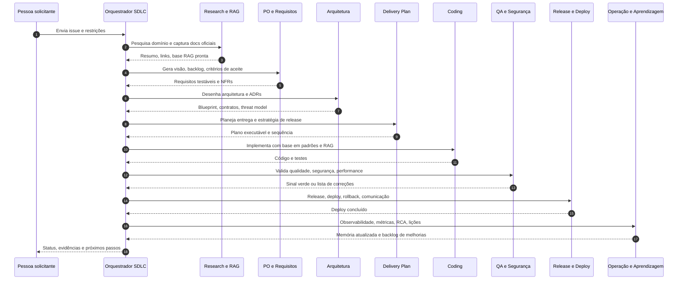

```mermaid
sequenceDiagram
autonumber
participant U as Pessoa solicitante
participant O as Orquestrador SDLC
participant R as Research e RAG
participant P as PO e Requisitos
participant A as Arquitetura
participant D as Delivery Plan
participant C as Coding
participant Q as QA e Segurança
participant L as Release e Deploy
participant S as Operação e Aprendizagem

U->>O: Envia issue e restrições
O->>R: Pesquisa domínio e captura docs oficiais
R-->>O: Resumo, links, base RAG pronta
O->>P: Gera visão, backlog, critérios de aceite
P-->>O: Requisitos testáveis e NFRs
O->>A: Desenha arquitetura e ADRs
A-->>O: Blueprint, contratos, threat model
O->>D: Planeja entrega e estratégia de release
D-->>O: Plano executável e sequência
O->>C: Implementa com base em padrões e RAG
C-->>O: Código e testes
O->>Q: Valida qualidade, segurança, performance
Q-->>O: Sinal verde ou lista de correções
O->>L: Release, deploy, rollback, comunicação
L-->>O: Deploy concluído
O->>S: Observabilidade, métricas, RCA, lições
S-->>O: Memória atualizada e backlog de melhorias
O-->>U: Status, evidências e próximos passos
```