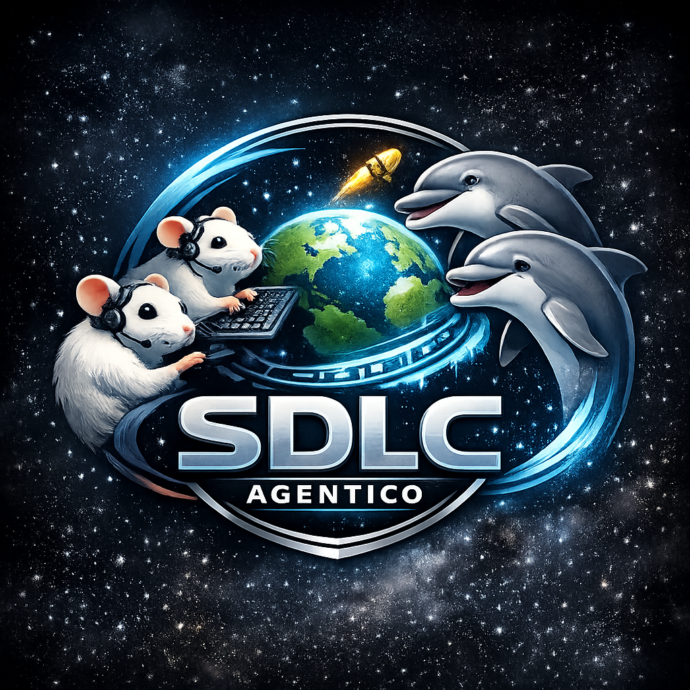
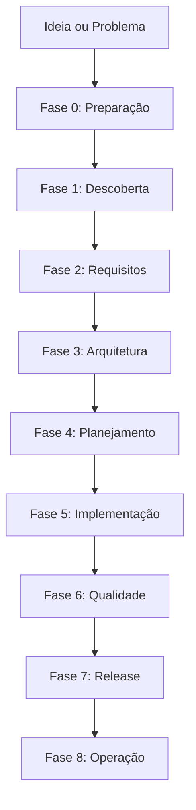
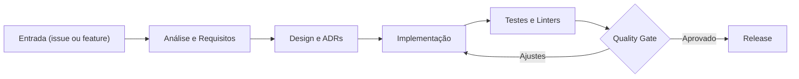

<!-- Core Badges -->
[](https://opensource.org/licenses/MIT)
[](https://github.com/arbgjr/sdlc_agentico/releases/tag/v3.0.4)
[](https://python.org)

<!-- AI Compatibility -->
[](https://code.claude.com/docs/en/sub-agents)


<!-- CI/CD & Quality -->
[](https://github.com/arbgjr/sdlc_agentico/actions/workflows/test-v2.yml)
[](https://github.com/arbgjr/sdlc_agentico/actions/workflows/validate-docs.yml)
[](https://github.com/arbgjr/sdlc_agentico/actions/workflows/ci.yml)
[](https://github.com/arbgjr/sdlc_agentico/actions/workflows/release.yml)

<!-- Community & Stats -->
[](https://github.com/arbgjr/sdlc_agentico/stargazers)
[](https://github.com/arbgjr/sdlc_agentico/network/members)
[](https://github.com/arbgjr/sdlc_agentico/issues)
[](https://github.com/arbgjr/sdlc_agentico/pulls)

<!-- Maintenance & Activity -->
[](https://github.com/arbgjr/sdlc_agentico/commits/main)
[](https://github.com/arbgjr/sdlc_agentico/graphs/commit-activity)
[](https://github.com/arbgjr/sdlc_agentico/graphs/contributors)

<p align="center">
  
</p>

# SDLC Agêntico

Sistema de desenvolvimento de software orientado por agentes de IA que automatiza e coordena todo o ciclo de vida do desenvolvimento.

## O Que É

O SDLC Agêntico é um framework que usa **47 agentes especializados** (33 orquestrados + 4 consultivos + 1 meta) para guiar seu projeto através de **9 fases (0-8)** do ciclo de desenvolvimento, desde a ideia inicial até a operação em produção.

```
┌─────────────────────────────────────────────────────────────────────────┐
│                         SDLC AGÊNTICO v3.0.4                            │
├─────────────────────────────────────────────────────────────────────────┤
│                                                                         │
│  Ideia → [Intake] → [Discovery] → [Requirements] → [Architecture]       │
│                                         ↓                               │
│  Produção ← [Release] ← [Quality] ← [Implementation] ← [Planning]       │
│                                                                         │
│  47 Agentes | 9 Fases | Quality Gates | Security by Design              │
│  Auto-Branch | IaC Generation | Doc Generation | GitHub Copilot         │
│                                                                         │
│  v3.0.4: GitHub Integration Hotfix | Orchestrator Auto-Sync After Phase 4│
│  v3.0.0: Python-First | 100% Python Hooks | Progressive Disclosure | 64%↓│
│  v2.3.3: HOTFIX | Silent Failures | 3 CRITICAL Bugs | Artifacts Validated│
│  v2.3.2: Sprint Fixes | 14 Bugs Fixed | CI/CD Ready | Quality Gates    │
│  v2.3.1: CRITICAL Fixes | sdlc-import LLM | 4 Bugs | No Crashes | 9 ADRs │
│  v2.3.0: Auto-Update Docs | Component Counts | Zero Effort | Always Sync│
│  v2.2.4: Critical Audit Fixes | graph.json | YAML | Version Loading     │
│  v2.2.2: Agent Instructions | Prevent Custom Scripts | Validation Tool  │
│  v2.2.1: Adversarial Audit System | Agent Strictness | Challenge-Based  │
│  v2.2.0: Sprint 2+3 | Documentation Enhancements | Execution Metrics    │
│  v2.1.15: Sprint 1 | Critical Fixes | adr_index | Version | Counts      │
│  v2.1.14: HOTFIX | LLM Instructions | Output Location | .project/       │
│  v2.1.13: CRITICAL | ADR Reconciliation | Similarity Bugs | 2 Fixes     │
│  v2.1.12: HOTFIX | Framework Preservation | Selective Cleanup          │
│  v2.1.11: Migration Bugfix | Always Check Artifacts | Standalone Script │
│  v2.1.10: Smart Update System | Artifact Migration | Data Preservation │
│  v2.1.9: Sprint 1-3 Complete | Critical Fixes | Framework Architecture │
│  v2.1.8: Configuration & Path Management | Dynamic Output Dirs          │
│  v2.1.7: ADR Reconciliation | Enhanced Confidence | Threat Expansion    │
│  v2.1.6: CI Fixed | splash.py NOW INCLUDED | First Working Release      │
│  v2.1.5: Splash Screen Bugfixes | Visibility Fixed | UX Improved        │
│  v2.1.4: .sdlcignore Support | Prevent Self-Scan | Issue #92 Created    │
│  v2.1.3: sdlc-import Critical Fixes | Graph Generation | YAML Security  │
│  v2.1.2: Framework/Project Separation | Dynamic Splash | Reusable       │
│  v2.0.7: Infrastructure Preservation | Backup/Restore | 4 Tests         │
│  v2.0.6: Post-Import Validation | Auto-Correction | Quality Reports     │
│  v2.0.4: sdlc-import v2.1 | 999 Tests | ADR/Graph/Issue/Migration       │
│  v2.0.3: Auto-Update v2 | Orchestrator Integration | Security           │
│  v2.0.0: Project Import | 30 Tech Detection | sdlc-import skill         │
│  v1.7.0: Structured Logging | Loki/Tempo/Grafana Integration            │
│  v1.6.0: GitHub Projects V2 | Milestones | Wiki Sync                    │
│  v1.5.0: Decay Scoring | Content Freshness | Curation Triggers          │
│  v1.4.0: Semantic Graph | Hybrid Search | Graph Visualization           │
│  v1.3.0: Document Processing | Frontend E2E | Anthropic Patterns        │
│                                                                         │
└─────────────────────────────────────────────────────────────────────────┘
```

## Diagramas Mermaid

### Fluxo do SDLC Agêntico



### Quality Gates e Segurança



## Requisitos

- **Python** 3.11+
- **Node.js** 18+
- **Claude Code** CLI
- **GitHub CLI** (`gh`)
- **Copilot Pro+/Business/Enterprise** (para coding agent)

## Instalação

⚠️ **IMPORTANTE**: O script de instalação requer privilégios **sudo** (Linux/macOS) ou **Administrador** (Windows) para instalar ferramentas do sistema (Python, Node.js, Git, GitHub CLI, poppler-utils, tesseract-ocr). O script solicitará senha durante a execução quando necessário.

### Opção 1: Download Direto (Linux/macOS/WSL)

```bash
# Definir versão desejada (consulte releases para última versão)
VERSION="v3.0.4"

# Download e extração (preserva permissões de execução)
curl -fsSL "https://github.com/arbgjr/sdlc_agentico/releases/download/${VERSION}/sdlc-agentico-${VERSION}.tar.gz" | tar -xzf -

# Executar setup (solicitará sudo quando necessário)
./\.agentic_sdlc/scripts/setup-sdlc.sh
```

> **WSL2**: Use os mesmos comandos acima. O tar.gz preserva as permissões Unix corretamente.
>
> **Releases**: https://github.com/arbgjr/sdlc_agentico/releases

### Opção 2: Via Script Automático

```bash
# Última versão (one-liner)
curl -fsSL https://raw.githubusercontent.com/arbgjr/sdlc_agentico/main/\.agentic_sdlc/scripts/setup-sdlc.sh | bash -s -- --from-release

# Versão específica
curl -fsSL https://raw.githubusercontent.com/arbgjr/sdlc_agentico/main/\.agentic_sdlc/scripts/setup-sdlc.sh | bash -s -- --from-release --version v3.0.4
```

Se o diretório `.claude/` já existir, o script perguntará o que fazer:
1. Fazer backup e substituir (recomendado)
2. Mesclar (manter existentes, adicionar novos)
3. Substituir sem backup
4. Cancelar

### Opção 2a: Windows (PowerShell nativo)

```powershell
# Abra PowerShell como Administrador (botão direito > Executar como Administrador)

# Definir versão desejada
$VERSION = "v3.0.4"

# Download e extração
curl.exe -fsSL "https://github.com/arbgjr/sdlc_agentico/releases/download/$VERSION/sdlc-agentico-$VERSION.zip" -o sdlc.zip
Expand-Archive -Path sdlc.zip -DestinationPath . -Force
Remove-Item sdlc.zip

# Executar setup (requer privilégios de Administrador)
.\.agentic_sdlc\scripts\setup-sdlc.ps1
```

> **Alternativa Git Bash**: Se você tem Git for Windows instalado, pode usar os comandos da Opção 1 no Git Bash (terminal incluído com Git).

### Opção 3: Clone do Repositório

```bash
# Clonar repositório
git clone https://github.com/arbgjr/sdlc_agentico.git
cd sdlc_agentico

# Executar setup
./\.agentic_sdlc/scripts/setup-sdlc.sh
```

### Ferramentas de Segurança (Opcional)

Para usar os recursos de security scanning (`/security-scan`, security gates):

```bash
# Instalar todas as ferramentas
./\.agentic_sdlc/scripts/install-security-tools.sh --all

# Ou instalar individualmente
./\.agentic_sdlc/scripts/install-security-tools.sh --semgrep   # SAST
./\.agentic_sdlc/scripts/install-security-tools.sh --trivy     # SCA/Container
./\.agentic_sdlc/scripts/install-security-tools.sh --gitleaks  # Secret Scanner
```

### Instalação Manual

```bash
pip install uv
uv tool install specify-cli --from git+https://github.com/github/spec-kit.git
npm install -g @anthropic-ai/claude-code
gh auth login
```

## Quick Start

```bash
# 1. Instalar dependências
./\.agentic_sdlc/scripts/setup-sdlc.sh

# 2. Iniciar Claude Code
claude

# 3. Escolher o fluxo adequado
/quick-fix "Corrigir bug X"           # Level 0 - Bug fixes
/new-feature "Nome da feature"        # Level 1 - Features simples
/sdlc-start "Criar nova API"          # Level 2/3 - Projetos completos
```

## Funcionalidades

### Agentes Especializados

| Fase | Agentes | O Que Fazem |
|------|---------|-------------|
| **Preparação** | intake-analyst, compliance-guardian | Analisam demandas, validam compliance |
| **Descoberta** | domain-researcher, doc-crawler, rag-curator | Pesquisam tecnologias, gerenciam conhecimento |
| **Requisitos** | product-owner, requirements-analyst, ux-writer | Priorizam backlog, escrevem user stories |
| **Arquitetura** | system-architect, adr-author, data-architect, threat-modeler, **iac-engineer** | Definem design, documentam decisões, analisam segurança, geram IaC |
| **Planejamento** | delivery-planner | Planejam sprints, estimam esforço |
| **Implementação** | code-author, code-reviewer, test-author, **iac-engineer** | Escrevem código, revisam, criam testes, aplicam IaC |
| **Qualidade** | qa-analyst, security-scanner, performance-analyst | Validam qualidade, escaneiam vulnerabilidades |
| **Release** | release-manager, cicd-engineer, change-manager, **doc-generator** | Coordenam releases, gerenciam pipelines, geram docs |
| **Operação** | incident-commander, rca-analyst, metrics-analyst, observability-engineer | Gerenciam incidentes, analisam causa raiz, rastreiam métricas |

### Quality Gates

Cada transição de fase passa por um **quality gate** que valida:
- Artefatos obrigatórios existem
- Critérios de qualidade foram atendidos
- Aprovações necessárias foram obtidas

### Security by Design

Segurança integrada em todas as fases via `security-gate.yml`:
- **Fase 2**: Requisitos de segurança documentados
- **Fase 3**: Threat model (STRIDE), riscos HIGH/CRITICAL mitigados
- **Fase 5**: Sem secrets hardcoded, validação de input
- **Fase 6**: SAST/SCA executados sem vulnerabilidades críticas
- **Fase 7**: Checklist de segurança completo

**Gatilhos de Escalação Automática**:
- CVSS >= 7.0
- Exposição de PII
- Mudanças em autenticação/autorização
- Alterações em criptografia
- Novos endpoints públicos

### Níveis de Complexidade (BMAD)

| Level | Nome | Comando | Quando Usar | Fases |
|-------|------|---------|-------------|-------|
| 0 | Quick Flow | `/quick-fix` | Bug fix, typo | 5, 6 |
| 1 | Feature | `/new-feature` | Feature simples | 2, 5, 6 |
| 2 | BMAD Method | `/sdlc-start` | Produto/serviço novo | 0-7 |
| 3 | Enterprise | `/sdlc-start` | Crítico, compliance | 0-8 + aprovações |

### Integração GitHub Copilot

O sistema se integra com o **GitHub Copilot Coding Agent**:

```bash
# Criar issues e atribuir ao Copilot
/sdlc-create-issues --assign-copilot

# O Copilot implementa automaticamente e cria PRs
```

### Integração GitHub Nativa (v1.6.0)

O sistema se integra nativamente com:

| Recurso | Automação |
|---------|-----------|
| **GitHub Projects V2** | Criado automaticamente no início do SDLC, atualizado a cada fase |
| **Milestones** | Criado para cada sprint, fechado no release |
| **Wiki** | Sincronizada com ADRs e documentação do projeto |
| **Labels** | Gerenciados automaticamente (`phase:0-8`, `complexity:0-3`, `type:*`) |

```bash
# Ver dashboard consolidado
/github-dashboard

# Sincronizar documentação com Wiki
/wiki-sync

# Criar issues com labels e milestone
/sdlc-create-issues
```

**Fluxo Automático:**
1. `/sdlc-start` → Cria Project V2 + Milestone "Sprint 1"
2. Cada transição de fase → Atualiza campo "Phase" das issues
3. `/release-prep` → Fecha Milestone + Sincroniza Wiki

### Observabilidade (v1.7.0)

O sistema inclui logging estruturado integrado com a stack de observabilidade:

| Componente | Porta | Propósito |
|------------|-------|-----------|
| **Loki** | 3100 | Agregação de logs |
| **Tempo** | 4318 | Tracing distribuído (OTLP) |
| **Grafana** | 3003 | Visualização e dashboards |

**Características:**
- JSON estruturado para ingestão no Loki
- Correlation IDs automáticos para rastreamento
- Níveis: DEBUG, INFO, WARNING, ERROR, CRITICAL
- Labels: `app`, `skill`, `phase`, `level`, `script`
- Dashboard pré-configurado em `.claude/config/logging/dashboards/`

**Variáveis de Ambiente:**
```bash
SDLC_LOG_LEVEL=DEBUG              # Nível de log (default: DEBUG)
SDLC_LOKI_ENABLED=true            # Habilita envio ao Loki
SDLC_LOKI_URL=http://localhost:3100
SDLC_TRACE_ENABLED=true           # Habilita tracing
SDLC_TEMPO_URL=http://localhost:4318
```

**Uso em Python:**
```python
from sdlc_logging import get_logger, log_operation
logger = get_logger(__name__, skill="decay-scoring", phase=6)
logger.info("Processing node", extra={"node_id": "ADR-001"})

with log_operation(logger, "batch_processing"):
    # Operação cronometrada automaticamente
    process_batch()
```

**Uso em Shell:**
```bash
source .claude/lib/shell/logging_utils.sh
sdlc_set_context skill="git-hooks" phase="5"
sdlc_log_info "Validating commit" "commit_hash=$COMMIT_HASH"
```

### Parallel Workers (v2.0) ⚡ NEW

Execução paralela de tarefas em Phase 5 com **2.5x speedup**:

| Feature | Benefício |
|---------|-----------|
| **parallel-workers** | Git worktrees isolados, zero merge conflicts |
| **simple-memory** | Working memory cache < 100ms para fatos rápidos |
| **session-handoff** | Continuidade automática entre sessões |
| **automation-loop** | Monitoramento e transição de estados automática |

**Usage:**
```bash
# Automático: orchestrator detecta e spawna em Phase 4→5 (Complexity 2+)
# Manual:
/parallel-spawn --batch .agentic_sdlc/projects/current/tasks.yml

# Monitoring:
python3 .claude/skills/parallel-workers/scripts/loop.py --project sdlc_agentico
```

**Architecture:**
- Workers isolados em `~/.worktrees/{project}/{task-id}/`
- State machine: NEEDS_INIT → WORKING → PR_OPEN → MERGED
- Platform independent (Linux-first)
- Full observability via Grafana dashboard

### Changelog

Veja [CHANGELOG.md](CHANGELOG.md) para histórico completo de versões e mudanças.


## Comandos Disponíveis

| Comando | Descrição |
|---------|-----------|
| `/sdlc-start` | Inicia novo workflow SDLC (Level 2/3) |
| `/quick-fix` | Fluxo rápido para bug fixes (Level 0) |
| `/new-feature` | Fluxo para features simples (Level 1) |
| `/phase-status` | Mostra status da fase atual |
| `/gate-check` | Verifica quality gate |
| `/adr-create` | Cria Architecture Decision Record |
| `/security-scan` | Executa scan de segurança |
| `/release-prep` | Prepara release |
| `/incident-start` | Inicia gestão de incidente |
| `/sdlc-create-issues` | Cria issues no GitHub |
| `/decay-status` | Mostra saúde do corpus RAG |
| `/validate-node` | Marca node como validado |
| `/github-dashboard` | Dashboard consolidado do GitHub |
| `/wiki-sync` | Sincroniza documentação com Wiki |
| `/alignment-status` | Mostra status de ODRs e trade-offs |
| `/logs-query` | Consulta logs estruturados (Loki) |
| `/odr-create` | Cria Organizational Decision Record |
| `/sdlc-flags` | Gerencia feature flags do SDLC |
| `/sdlc-version` | Mostra versão e changelog do framework |
| `/simulate` | Simula cenários de decisão arquitetural |

## Estrutura do Projeto

```
.claude/
├── agents/           # 47 agentes especializados (33 + 4 consultivos + 1 meta)
├── skills/           # 30 skills reutilizáveis
├── commands/         # 29 comandos do usuário
├── hooks/            # 15 hooks de automação (100% Python)
├── lib/              # Bibliotecas compartilhadas (v1.7.0)
│   ├── python/       # sdlc_logging.py, sdlc_tracing.py
│   └── shell/        # logging_utils.sh
├── config/           # Configurações centralizadas
│   └── logging/      # logging.yml, dashboards/
└── settings.json     # Configuração central

.agentic_sdlc/        # Artefatos do SDLC (NOVO)
├── projects/         # Projetos gerenciados
├── references/       # Documentos de referência (legal, técnico, business)
├── templates/        # Templates (ADR, spec, threat-model)
├── corpus/           # Corpus de conhecimento RAG
└── sessions/         # Histórico de sessões

\.agentic_sdlc/scripts/
├── setup-sdlc.sh             # Script de instalação
└── install-security-tools.sh # Ferramentas de segurança opcionais

\.agentic_sdlc/docs/
├── guides/                   # Guias de uso
│   ├── quickstart.md         # Guia rápido
│   ├── infrastructure.md     # Setup e integração
│   └── troubleshooting.md    # Resolução de problemas
├── sdlc/                     # Documentação do SDLC
│   ├── agents.md             # Catálogo de agentes
│   ├── commands.md           # Referência de comandos
│   └── overview.md           # Visão geral do framework
└── engineering-playbook/     # Padrões de engenharia
    ├── manual-desenvolvimento/ # Standards, práticas, qualidade
    └── stacks/               # .NET, Python, Rust, DevOps
```

## Documentação

| Documento | Descrição |
|-----------|-----------|
| [quickstart.md](\.agentic_sdlc/docs/guides/quickstart.md) | Guia rápido de início |
| [infrastructure.md](\.agentic_sdlc/docs/guides/infrastructure.md) | Setup e integração |
| [agents.md](\.agentic_sdlc/docs/sdlc/agents.md) | Catálogo de agentes |
| [commands.md](\.agentic_sdlc/docs/sdlc/commands.md) | Referência de comandos |
| [engineering-playbook](\.agentic_sdlc/docs/engineering-playbook/) | Padrões de engenharia |
| [CONTRIBUTING.md](CONTRIBUTING.md) | Como contribuir |

## Exemplo de Uso

```bash
# 1. Iniciar workflow para nova feature
claude "/sdlc-start Portal de histórico de pedidos para clientes"

# 2. O intake-analyst analisa e classifica (Level 2)
# 3. domain-researcher pesquisa tecnologias
# 4. requirements-analyst escreve user stories
# 5. system-architect define arquitetura
# 6. delivery-planner planeja sprint

# 7. Criar issues para implementação
claude "/sdlc-create-issues --assign-copilot"

# 8. Copilot implementa e cria PRs
# 9. code-reviewer revisa
# 10. security-scanner valida
# 11. release-manager coordena deploy
```

## Métricas Rastreadas

O sistema rastreia automaticamente:

- **DORA Metrics**: Deployment frequency, lead time, CFR, MTTR
- **Code Quality**: Coverage, complexity, tech debt
- **Process**: PR cycle time, review time, rework rate

## Limitações Conhecidas

### Ambiente
- **Sistema Operacional**: Testado em Windows via WSL2.
- **Node.js**: Requer versão 18 ou superior
- **Python**: Requer versão 3.11 ou superior

### Dependências Externas
- **Claude Code CLI**: Requer conta Anthropic ativa com acesso ao Claude Code
- **Spec Kit**: Opcional, mas necessário para comandos de especificação
- **GitHub CLI (gh)**: Necessário para integração com GitHub e Copilot Coding Agent
- **Ferramentas de Segurança**: gitleaks, semgrep, trivy são opcionais (instaláveis via `\.agentic_sdlc/scripts/install-security-tools.sh`)

### Funcionalidades
- **Lightweight Agents**: 4 agentes (failure-analyst, interview-simulator, requirements-interrogator, tradeoff-challenger) são minimalistas e dependem da skill `system-design-decision-engine`
- **Gates de Qualidade**: Alguns checks usam padrões glob que podem não encontrar arquivos em estruturas não-padrão
- **Auto-Branch**: Requer que o repositório tenha permissão de push para criar branches

### Integrações
- **GitHub Copilot Coding Agent**: Requer GitHub Copilot Pro+/Business/Enterprise
- **RAG Corpus**: Funcionalidade experimental, corpus é populado pelo framework.

## Troubleshooting

Consulte [\.agentic_sdlc/docs/guides/troubleshooting.md](\.agentic_sdlc/docs/guides/troubleshooting.md) para resolução de problemas comuns.

## Contribuindo

Veja [CONTRIBUTING.md](CONTRIBUTING.md) para guidelines de contribuição.

## Licença

[MIT](LICENSE)

---

**Criado em conjunto com** Claude Code + GitHub Copilot

