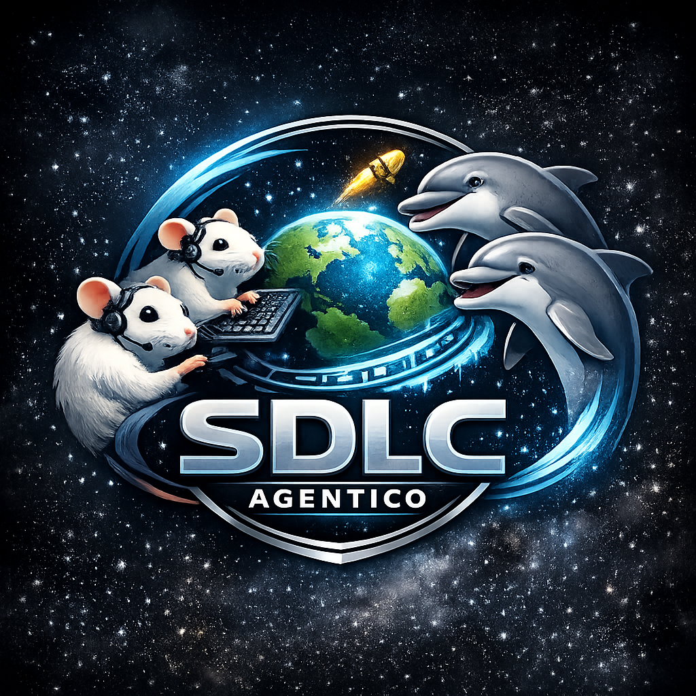
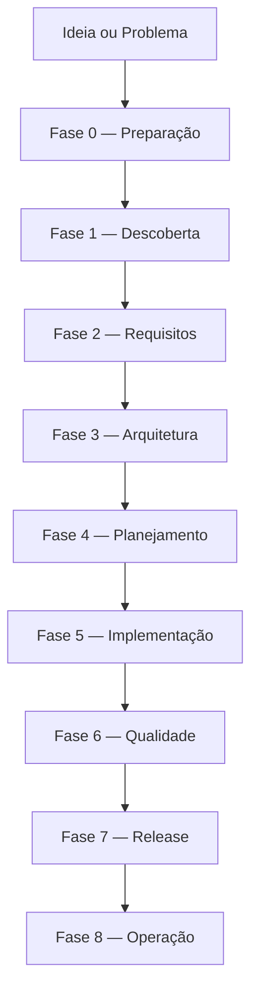
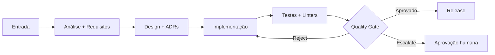

<!-- Core -->
[](https://opensource.org/licenses/MIT)
[](https://github.com/arbgjr/sdlc_agentico/releases/tag/v3.3.0)
[](https://python.org)

<!-- Compatibility -->
[](https://code.claude.com/docs/en/sub-agents)

<!-- CI -->
[](https://github.com/arbgjr/sdlc_agentico/actions/workflows/test-v2.yml)
[](https://github.com/arbgjr/sdlc_agentico/actions/workflows/validate-docs.yml)
[](https://github.com/arbgjr/sdlc_agentico/actions/workflows/ci.yml)
[](https://github.com/arbgjr/sdlc_agentico/actions/workflows/release.yml)

<!-- Community -->
[](https://github.com/arbgjr/sdlc_agentico/stargazers)
[](https://github.com/arbgjr/sdlc_agentico/network/members)
[](https://github.com/arbgjr/sdlc_agentico/issues)
[](https://github.com/arbgjr/sdlc_agentico/pulls)

<!-- Activity -->
[](https://github.com/arbgjr/sdlc_agentico/commits/main)
[](https://github.com/arbgjr/sdlc_agentico/graphs/commit-activity)
[](https://github.com/arbgjr/sdlc_agentico/graphs/contributors)

<p align="center">
  
</p>

# SDLC Agêntico

Framework de desenvolvimento de software orientado por agentes de IA. Cobre o ciclo inteiro — da intake à operação — com disciplina de Spec-Driven Development, BMAD Method, Security by Design e um harness de avaliação que guarda o próprio framework contra regressão.

## Visão geral

**O que é.** Um orquestrador de agentes especializados que executa 9 fases do SDLC com quality gates entre cada transição, artefatos padronizados e observabilidade nativa.

**Por que existe.** Fases caem na entropia sem disciplina explícita: spec que vira código sem aprovação, decisão arquitetural perdida, release sem threat model. Este framework torna a disciplina *executável* — não uma checklist de slide.

**Como usa.** Você invoca comandos (`/specify`, `/plan`, `/tasks`, `/bmad-plan`, `/gate-check`, `/release-prep`…); o framework escolhe os agentes, aplica os gates, escreve os artefatos e paraleliza via Copilot Cloud Agent quando apropriado.

## Em números

| Componente | Total |
|---|---|
| Agentes especializados | **40** (6 tier-1 strict contracts + 34 tier-2) |
| Skills reutilizáveis | **33** |
| Comandos slash | **37** |
| Hooks de automação | **15** |
| Quality gates | **14** |
| ADRs capturados | **2** |
| Eval suites (regressão) | **9** |
| Casos golden verdes | **79 / 79** |

## Arquitetura

### Fluxo de fases


```mermaid
flowchart TB
  Idea["Ideia ou Problema"] --> Prep["Fase 0 — Preparação"]
  Prep --> Discovery["Fase 1 — Descoberta"]
  Discovery --> Req["Fase 2 — Requisitos"]
  Req --> Arch["Fase 3 — Arquitetura"]
  Arch --> Plan["Fase 4 — Planejamento"]
  Plan --> Impl["Fase 5 — Implementação"]
  Impl --> Qual["Fase 6 — Qualidade"]
  Qual --> Release["Fase 7 — Release"]
  Release --> Ops["Fase 8 — Operação"]
```

### Quality gates


```mermaid
flowchart LR
  Start["Entrada"] --> Analyze["Análise + Requisitos"]
  Analyze --> Design["Design + ADRs"]
  Design --> Build["Implementação"]
  Build --> Tests["Testes + Linters"]
  Tests --> Gate{"Quality Gate"}
  Gate -->|Aprovado| Release["Release"]
  Gate -->|Escalate| Human["Aprovação humana"]
  Gate -->|Reject| Build
```

## Começando

### Requisitos

- Python 3.11+
- Node.js 18+
- Claude Code CLI
- GitHub CLI (`gh`)
- GitHub Copilot Pro+ / Business / Enterprise (para dispatch ao Copilot Cloud Agent)

### Instalação

> O setup requer `sudo` no Linux/macOS ou Administrador no Windows para instalar dependências de sistema.

**Linux / macOS / WSL2:**

```bash
VERSION="v3.3.0"
curl -fsSL "https://github.com/arbgjr/sdlc_agentico/releases/download/${VERSION}/sdlc-agentico-${VERSION}.tar.gz" | tar -xzf -
./.agentic_sdlc/scripts/setup-sdlc.sh
```

**Windows (PowerShell Admin):**

```powershell
$VERSION = "v3.3.0"
curl.exe -fsSL "https://github.com/arbgjr/sdlc_agentico/releases/download/$VERSION/sdlc-agentico-$VERSION.zip" -o sdlc.zip
Expand-Archive -Path sdlc.zip -DestinationPath . -Force
Remove-Item sdlc.zip
.\.agentic_sdlc\scripts\setup-sdlc.ps1
```

**Alternativas**, ferramentas de segurança opcionais, instalação manual e one-liner via script remoto: [`.agentic_sdlc/docs/guides/quickstart.md`](.agentic_sdlc/docs/guides/quickstart.md).

### Primeiro uso

```bash
claude

# Level 0 — bug fix, typo
/quick-fix "Corrigir off-by-one no paginador"

# Level 1 — feature em serviço existente
/new-feature "Adicionar ordenação por data no histórico"

# Level 2/3 — produto/serviço novo
/sdlc-start "Portal de histórico de pedidos"
```

O primeiro comando que um fluxo Level ≥ 1 executa é `/constitution`, que carrega os princípios do projeto em contexto antes de qualquer decisão.

## Conceitos

### Spec-Driven Development

Nenhum código entra em *feature branch* sem spec aprovada. O fluxo canônico é:

```
/specify <feature>     produz .specify/specs/<slug>/spec.md (status=draft)
/clarify <slug>        elimina ambiguidade via requirements-interrogator
/analyze <slug>        valida contra Constituição e promove para approved
/plan <slug>           produz plan.md, data-model, api-contracts, threat-model, ADRs
/tasks <slug>          shards em tasks com context bundle (BMAD)
```

O gate `phase-2-to-3` é **bloqueador** — recusa avanço sem esses artefatos.

### BMAD — Níveis de complexidade

| Level | Nome | Comando | Quando |
|---|---|---|---|
| 0 | Quick Flow | `/quick-fix` | Bug, typo, one-liner |
| 1 | Feature | `/new-feature` | Feature em serviço existente |
| 2 | BMAD Method | `/sdlc-start` | Produto/serviço novo |
| 3 | Enterprise | `/sdlc-start` | Compliance, multi-equipe, crítico |

O classificador `detect_level.py` é determinístico, com escalators automáticos: `auth`, PII, pagamentos, crypto, CVSS ≥ 7.0 elevam o Level mínimo.

Level ≥ 2 executa `/bmad-plan` (fase deliberativa única) seguido de `/bmad-dev` (ciclo executivo paralelizado).

### Quality Gates

Cada transição passa por um gate que valida artefatos obrigatórios, critérios de qualidade e aprovações necessárias. Os gates vivem em `.claude/skills/gate-evaluator/gates/` e são consumidos por `/gate-check`. Decisão possível: `approve`, `reject`, `escalate` (quando `human_approval: required`).

### Security by Design

Integrado no fluxo, não empilhado no fim:

- **Fase 2** — requisitos de segurança documentados
- **Fase 3** — threat model STRIDE; HIGH/CRITICAL mitigados
- **Fase 5** — sem secrets hardcoded; validação de input
- **Fase 6** — SAST + SCA; zero críticos não-resolvidos
- **Fase 7** — checklist completo de segurança

**Gatilhos automáticos de escalação**: CVSS ≥ 7.0, exposição de PII, mudanças em auth/authz, alterações de criptografia, novos endpoints públicos.

### Paralelismo — Copilot Cloud Agent first

Para Phase 6 (Implementação), a estratégia padrão é o **GitHub Copilot Cloud Agent** (ADR-002). Tasks shardadas pelo `/tasks` carregam `parallelization_hint` no frontmatter:

| Hint | Rota |
|---|---|
| `copilot_cloud_agent` (default) | Dispatcher cria issues atribuídas a `@copilot`; PRs voltam para review-relay |
| `local_worker` | Fallback: `parallel-workers` com git worktrees locais |
| `human_only` | GitHub project board, sem agente |

`review_relay.py` roda bandit + ruff + secret scanner nas adições do diff e tagga `@copilot` em findings CRITICAL/HIGH para retry. Limite: 3 retries por task.

### Observabilidade e SLOs

Logging estruturado JSON com correlation IDs; tracing OTLP em `Tempo`; métricas agregadas em `Loki`; dashboards `Grafana` (inclui o painel de burn-rate SLO).

Configurações chave: `.claude/config/logging/logging.yml`, `.claude/config/slos.yml`, `.claude/config/logging/dashboards/`.

SLOs declarados com alvo, janela de medição, SLI como query e runbook associado em `.agentic_sdlc/docs/runbooks/`.

### Harness de avaliação

Regressão executável. Cada agente/skill crítico tem um eval em `evals/<suite>/runner.py` com golden cases. Estado atual: **9 suites, 79 cases, 100% passando**.

```bash
python3 evals/run_all.py
```

Mudança em prompt, em template ou em script crítico passa por este gate antes de merge.

## Comandos

### Spec-Driven Development

| Comando | Função |
|---|---|
| `/constitution` | Carrega a Constituição v1.0.0 em contexto |
| `/specify <desc>` | Cria `.specify/specs/<slug>/spec.md` |
| `/clarify <slug>` | Loop de eliminação de ambiguidade |
| `/analyze <slug>` | Valida spec/plan/tasks e promove status |
| `/plan <slug>` | Gera plan.md + data-model + threat-model + ADRs |
| `/tasks <slug>` | Shards em tasks com context bundle |

### BMAD

| Comando | Função |
|---|---|
| `/bmad-plan <slug>` | Planning Phase completo (Level ≥ 2) |
| `/bmad-dev <slug>` | Dev Cycle com paralelização roteada |

### Fluxo rápido / Feature

| Comando | Função |
|---|---|
| `/quick-fix` | Fluxo Level 0 |
| `/new-feature` | Fluxo Level 1 |
| `/sdlc-start` | Fluxo Level 2/3 completo |

### Gates, Release e Operação

| Comando | Função |
|---|---|
| `/gate-check` | Avalia um quality gate |
| `/phase-status` | Status da fase corrente |
| `/security-scan` | SAST + SCA + secrets |
| `/release-prep` | Prepara release, gera notas, cria tag |
| `/audit-phase` | Auditoria adversarial pós-gate |
| `/incident-start` | Abre fluxo de incidente |

### Governança e conhecimento

| Comando | Função |
|---|---|
| `/adr-create` | Cria Architecture Decision Record |
| `/odr-create` | Cria Organizational Decision Record |
| `/alignment-status` | Dashboard de ODRs e trade-offs |
| `/decay-status` | Saúde do corpus RAG |
| `/validate-node` | Marca node de RAG como validado |
| `/simulate` | Simulação estratégica (trade-off) |
| `/logs-query` | Consulta logs estruturados |

### Integração GitHub

| Comando | Função |
|---|---|
| `/sdlc-create-issues` | Cria issues com labels e milestones SDLC |
| `/github-dashboard` | Dashboard consolidado do projeto |
| `/wiki-sync` | Sincroniza docs com GitHub Wiki |

### Meta

| Comando | Função |
|---|---|
| `/sdlc-version` | Versão corrente + changelog |
| `/sdlc-flags` | Gerencia feature flags |

## Estrutura do projeto

```
.claude/
├── agents/              # 40 agentes (6 tier-1 + 34 tier-2 contracts)
├── skills/              # 33 skills
├── commands/            # 37 slash-commands
├── hooks/               # 15 hooks de automação (100% Python)
├── lib/
│   ├── python/          # sdlc_logging, sdlc_tracing, resilience, token_counter
│   └── shell/           # logging_utils.sh
├── config/
│   ├── logging/         # logging.yml, dashboards
│   └── slos.yml         # SLOs + burn-rate windows
└── settings.json        # Configuração central

.specify/
├── memory/              # constitution.md (v1.0.0)
└── specs/<slug>/        # spec.md, plan.md, tasks.md, threat-model.yml, ...

.agentic_sdlc/           # Artefatos do framework
├── templates/           # spec, plan, story-context, agent-contract, ADR
├── corpus/              # RAG: decisions, learnings, patterns, concepts
├── references/          # Documentos externos indexados
├── docs/
│   ├── guides/          # quickstart, infrastructure, troubleshooting
│   ├── sdlc/            # agents, commands, overview
│   ├── runbooks/        # Runbooks de SLO
│   └── engineering-playbook/
└── scripts/             # setup-sdlc.sh, install-security-tools.sh

.project/                # Artefatos de projetos executados
├── corpus/nodes/decisions/  # ADRs do projeto
├── reports/             # Scans, migrações, tech debt
└── projects/<id>/       # Estado, arquitetura, security

evals/                   # Harness de regressão
├── _lib/harness.py
├── run_all.py
└── <suite>/runner.py    # Um runner por agente/skill crítico
```

## Documentação

| Documento | Descrição |
|---|---|
| [quickstart.md](.agentic_sdlc/docs/guides/quickstart.md) | Guia rápido de início |
| [infrastructure.md](.agentic_sdlc/docs/guides/infrastructure.md) | Setup e integração |
| [troubleshooting.md](.agentic_sdlc/docs/guides/troubleshooting.md) | Resolução de problemas |
| [agents.md](.agentic_sdlc/docs/sdlc/agents.md) | Catálogo de agentes |
| [commands.md](.agentic_sdlc/docs/sdlc/commands.md) | Referência de comandos |
| [engineering-playbook](.agentic_sdlc/docs/engineering-playbook/) | Padrões de engenharia |
| [runbooks](.agentic_sdlc/docs/runbooks/) | Runbooks de SLO |
| [CHANGELOG.md](CHANGELOG.md) | Histórico de versões |
| [CONTRIBUTING.md](CONTRIBUTING.md) | Como contribuir |

## Métricas rastreadas

- **DORA**: deployment frequency, lead time, change failure rate, MTTR
- **Code Quality**: cobertura, complexidade, tech debt
- **Processo**: PR cycle time, review time, rework rate
- **SDLC específicas**: gate decision latency, Copilot task wallclock, review rejection rate, clarify rounds to approval, circuit breaker open minutes

Definições formais em `.claude/config/slos.yml`.

## Limitações conhecidas

- **Lightweight agents** (`failure-analyst`, `interview-simulator`, `requirements-interrogator`, `tradeoff-challenger`) dependem da skill `system-design-decision-engine` para entregar valor.
- **Copilot Cloud Agent** requer GitHub Copilot Pro+ / Business / Enterprise e habilitação do *coding agent* no repositório.
- **Auto-branch** requer permissão de push no repositório.
- **RAG corpus** é populado pelo framework; requer maturidade após algumas execuções reais.
- **Gate YAMLs** usam glob — estruturas de projeto não-convencionais podem exigir ajuste dos patterns.

## Contribuindo

[CONTRIBUTING.md](CONTRIBUTING.md) descreve o fluxo. Toda contribuição ao framework passa pelo próprio framework: spec + plan + tasks + gates + evals.

## Licença

[MIT](LICENSE)

---

**Criado em conjunto com** Claude Code + GitHub Copilot
